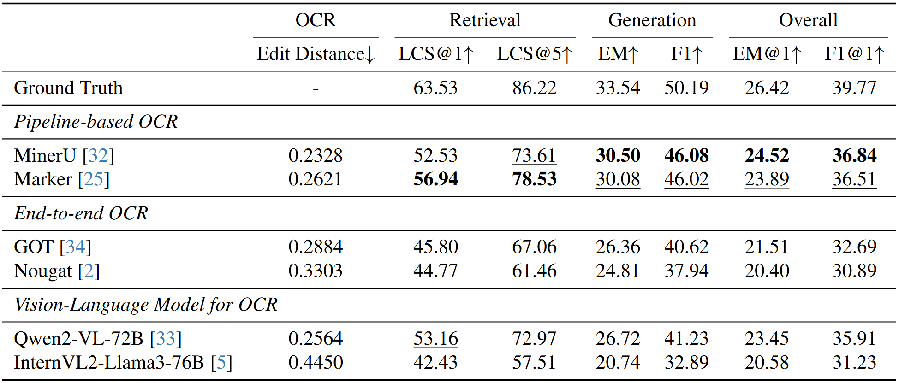

<h1 align="center">
    OCR Hinders RAG: Evaluating the Cascading Impact of OCR on Retrieval-Augmented Generation
</h1>

<div align="center">

[\[📜 arXiv\]](https://arxiv.org/abs/2412.02592v1) | [\[Dataset (🤗Hugging Face)\]](https://huggingface.co/datasets/opendatalab/OHR-Bench) | [\[Dataset (OpenDataLab)\]]()

</div>

This repository contains the official code of **OHR-Bench**, a benchmark designed to evaluate the cascading impact of OCR on RAG.

# Overview
- **PDF, gt structured data and Q&A datasets: [[🤗 Hugging Face](https://huggingface.co/datasets/opendatalab/OHR-Bench)] `data/pdfs`, `data/ground_truth_structured_data` and `data/qas`**. It includes 4000+ unstructured PDF pages from various domains, including Textbook, Law, Finance, Newspaper, Manual and Academia and Q&A datasets sourced from multimodal document elements. Each PDF page is equipped with a human-verified ground truth structured data.
- **Perturbed data with OCR errors: [[🤗 Hugging Face](https://huggingface.co/datasets/opendatalab/OHR-Bench)] `data/perturbed_structured_data`**. In order to conduct in-depth analysis of the OCR's impact on RAG, OHR-Bench identifies *Semantic Noise* and *Formatting Noise* and introduce them with mild, moderate and severe perturbation based on real-world OCR errors.
- **Evaluation framework: [[Github opendatalab/OHR-Bench](https://github.com/opendatalab/OHR-Bench)]**. We provide a RAG evaluation framework to assess the impact of OCR processed structured data and our perturbed data on RAG including retrieval, generation and overall performance.


## Evaluation Results


We evaluate the suitability of current OCR solutions for real-world RAG applications by conducting comprehensive experiments with our OHR-Bench.
We derive conclusions as follows:

- Pipeline-based OCR demonstrates the best performance. Employing Marker achieves the best retrieval performance across all OCR solutions, while MinerU dominates the generation and overall evaluation.
- All OCR solutions suffer performance degradation. Even the best solutions show a decrease of 1.9 in EM@1 and 2.93 F1@1 in the overall evaluation, with greater losses in the retrieval and generation stages.

# Getting Started
## Installation
```bash
pip install -r requirements.txt
```

## Dataset preparation
### OCR processed structured data
To evaluate your OCR results using this benchmark, place the parsed structured data (PDFs can be found at [Hugging Face](https://huggingface.co/datasets/opendatalab/OHR-Bench)) in the `data/retrieval_base` directory. Use the ground truth (gt) data as an example. The sub-folder names indicate the domain of the parsed results, and each JSON file, named as the same of corresponding PDF files, should contain the corresponding parsed results.

<details>
<summary>Directory Structure</summary>

```bash
retrieval_base/gt/ # We provide gt and MinerU processed structured data as illustration here
├── finance # Domain
│   ├── 3M_2023Q2_10Q.json # Parsed results
│   ├── ...
├── textbook
...
```

</details>

<details>
<summary>OCR Processed Data</summary>

```json
[
    {
        "page_idx": "finance/JPMORGAN_2021Q1_10Q", // Page index
        "text": "...", // OCR processed structured data
    },
    ...
]
```

</details>

### QA data
The qa data is placed in `data/qas.json`. Each JSON file should be structured as follows:

<details>
<summary>Q&A JSON</summary>

```json
[
    {
        "doc_name": "finance/JPMORGAN_2021Q1_10Q", // Document source
        "ID": "00073cc2-c801-467c-9039-fca63c78c6a9", // Unique ID
        "questions": "What was the total amount of nonaccrual loans retained as of March 31, 2021?",
        "answers": "842",
        "doc_type": "finance", // Q&A domain.
        "answer_form": "Numeric", // Answer format.
        "evidence_source": "table", // Evidence source.
        "evidence_context": "Nonaccrual loans retained $^{(\\mathrm{a})}$ & \\$ & 842 & \\$ & 689 & $22 \\%$", // Evidence.
        "evidence_page_no": 24
    },
    ...
]
```

</details>


## LLMs preparation
In `src/configs`, configure your local LLM path or GPT API.
```python
GPT_api_key = 'You KEY Here'  # openai.api_key
...
Qwen2_7B_local_path = 'Qwen/Qwen2-7B-Instruct' # download from Hugging Face or your local path
```


# Run Evaluation
To evaluate your OCR results, follow the instructions in the Dataset Preparation section to organize your OCR data.

```bash
# The first argument specifies which OCR results to use for evaluation.
# The second argument specifies the retrievers or LLMs.

# Generation
bash shell/generation.sh gt qwen2_7b
# Retrieval
bash shell/retrieval.sh gt qwen2_7b
# End-to-end
bash shell/end2end.sh gt qwen2_7b
```

# Acknowledgement
The evaluation framework is based on [CRUD](https://github.com/IAAR-Shanghai/CRUD_RAG), thanks so much for this brilliant project.

# Citation
```
@article{zhang2024ocr,
  title={OCR Hinders RAG: Evaluating the Cascading Impact of OCR on Retrieval-Augmented Generation},
  author={Junyuan Zhang and Qintong Zhang and Bin Wang and Linke Ouyang and Zichen Wen and Ying Li and Ka-Ho Chow and Conghui He and Wentao Zhang},
  journal={arXiv preprint arXiv:2412.02592},
  year={2024}
}
```

# Copyright Statement
The PDFs are collected from public online channels and community user contributions. Content that is not allowed for distribution has been removed. The dataset is for research purposes only and not for commercial use. If there are any copyright concerns, please contact OpenDataLab@pjlab.org.cn.
