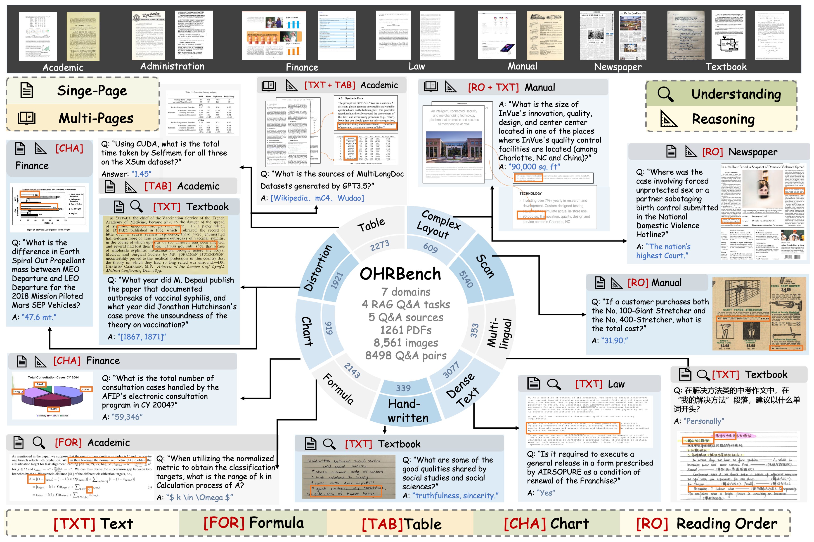

<h1 align="center">
    OCR Hinders RAG: Evaluating the Cascading Impact of OCR on Retrieval-Augmented Generation
</h1>

<div align="center">

[\[📜 arXiv\]](https://arxiv.org/abs/2412.02592v2) | [\[Dataset (🤗Hugging Face)\]](https://huggingface.co/datasets/opendatalab/OHR-Bench) | [\[Dataset (OpenDataLab)\]](https://opendatalab.com/OpenDataLab/OHR-Bench)

</div>



This repository contains the official code of **OHR-Bench**, a benchmark designed to evaluate the cascading impact of OCR on RAG.

# News
- 2025.12.3: 🤗🤗 We have released our latest work [TRivia](https://github.com/opendatalab/TRivia) and [TRivia-3B](https://huggingface.co/opendatalab/TRivia-3B), a self-supervised training framework for table recognition, and an advanced table recognition VLM trained on Qwen2.5-VL-3B.
- 2025.6.30: Updating the results of MongkeyOCR, Nanonets-OCR-s and Azure Document Intelligence.
- 2025.6.26: OHR-Bench has been accepted by ICCV 2025!

# Overview
- **PDF, gt structured data and Q&A datasets: [[🤗 Hugging Face](https://huggingface.co/datasets/opendatalab/OHR-Bench)] `pdfs.zip`, `data/retrieval_base/gt`, `data/qas_v2.json`**. It includes 8500+ unstructured PDF pages from 7 domains, including Textbook, Law, Finance, Newspaper, Manual, Academic and Administration and 8498 Q&A datasets sourced from 5 key components for OCR in document parsing, including plain text, table, formula, chart and reading order. Each PDF page is equipped with a human-verified ground truth structured data.
- **Perturbed data with OCR errors: [[🤗 Hugging Face](https://huggingface.co/datasets/opendatalab/OHR-Bench)] `formatting_noise_[mild/moderate/severe]` and `semantic_noise_[GOT/MinerU/Qwen2.5-VL-72B]_[mild/moderate/severe]`**. In order to conduct in-depth analysis of the OCR's impact on RAG, OHR-Bench identifies *Semantic Noise* and *Formatting Noise* and introduce them with mild, moderate and severe perturbation based on real-world OCR errors.
- **Evaluation framework: [[Github opendatalab/OHR-Bench](https://github.com/opendatalab/OHR-Bench)]**. We provide a RAG evaluation framework to assess the impact of OCR processed structured data and our perturbed data on RAG including retrieval, generation and overall performance.


## Evaluation Results
<table>
    <thead>
        <tr>
            <th></th>
            <th>OCR</th>
            <th colspan="6">Retrieval</th>
            <th colspan="6">Generation</th>
            <th colspan="6">Overall</th>
        </tr>
        <tr>
            <th></th>
            <th>E.D.<span>&darr;</span></th>
            <th>TXT<span>&uarr;</span></th>
            <th>TAB<span>&uarr;</span></th>
            <th>FOR<span>&uarr;</span></th>
            <th>CHA<span>&uarr;</span></th>
            <th>RO<span>&uarr;</span></th>
            <th>ALL<span>&uarr;</span></th>
            <th>TXT<span>&uarr;</span></th>
            <th>TAB<span>&uarr;</span></th>
            <th>FOR<span>&uarr;</span></th>
            <th>CHA<span>&uarr;</span></th>
            <th>RO<span>&uarr;</span></th>
            <th>ALL<span>&uarr;</span></th>
            <th>TXT<span>&uarr;</span></th>
            <th>TAB<span>&uarr;</span></th>
            <th>FOR<span>&uarr;</span></th>
            <th>CHA<span>&uarr;</span></th>
            <th>RO<span>&uarr;</span></th>
            <th>ALL<span>&uarr;</span></th>
        </tr>
    </thead>
    <tbody>
        <tr>
            <td>Ground Truth</td>
            <td>-</td>
            <td>81.6</td>
            <td>69.8</td>
            <td>75.2</td>
            <td>70.3</td>
            <td>9.8</td>
            <td>70.4</td>
            <td>49.3</td>
            <td>46.0</td>
            <td>34.0</td>
            <td>47.0</td>
            <td>28.2</td>
            <td>43.8</td>
            <td>44.9</td>
            <td>34.6</td>
            <td>28.0</td>
            <td>32.9</td>
            <td>18.7</td>
            <td>36.0</td>
        </tr>
        <tr>
            <td colspan="20"><i>Pipeline-based OCR</i></td>
        </tr>
        <tr>
            <td>MinerU-0.9.3</td>
            <td>0.24</td>
            <td>68.1</td>
            <td>48.6</td>
            <td>51.3</td>
            <td>16.5</td>
            <td><b>5.9</b></td>
            <td>50.5</td>
            <td><b>45.7</b></td>
            <td>39.3</td>
            <td>28.6</td>
            <td>9.7</td>
            <td><b>29.5</b></td>
            <td><u>36.6</u></td>
            <td><b>41.4</b></td>
            <td>28.5</td>
            <td>23.0</td>
            <td>9.3</td>
            <td><b>17.8</b></td>
            <td><u>29.9</u></td>
        </tr>
        <tr>
            <td>Marker-1.2.3</td>
            <td>0.28</td>
            <td><u>75.5</u></td>
            <td>58.2</td>
            <td>55.5</td>
            <td>20.0</td>
            <td><b>5.9</b></td>
            <td>57.0</td>
            <td><u>44.4</u></td>
            <td>37.8</td>
            <td>27.8</td>
            <td>10.9</td>
            <td>26.2</td>
            <td>35.9</td>
            <td>40.1</td>
            <td>28.1</td>
            <td>22.3</td>
            <td>10.0</td>
            <td><u>16.2</u></td>
            <td>29.4</td>
        </tr>
        <tr>
            <td>Azure</td>
            <td>-</td>
            <td><b>78.0</b></td>
            <td>59.4</td>
            <td>55.2</td>
            <td><b>45.2</b></td>
            <td><u>5.8</u></td>
            <td><b>60.6</b></td>
            <td>41.0</td>
            <td>37.1</td>
            <td>27.1</td>
            <td>22.9</td>
            <td><u>27.3</u></td>
            <td>35.0</td>
            <td>37.5</td>
            <td>28.1</td>
            <td>22.6</td>
            <td>15.1</td>
            <td><u>17.5</u></td>
            <td>28.9</td>
        </tr>
        <tr>
            <td colspan="20"><i>End-to-end OCR</i></td>
        </tr>
        <tr>
            <td>GOT</td>
            <td>0.27</td>
            <td>62.5</td>
            <td>41.1</td>
            <td>49.0</td>
            <td>17.4</td>
            <td>3.7</td>
            <td>45.8</td>
            <td>37.5</td>
            <td>28.5</td>
            <td>24.1</td>
            <td>8.5</td>
            <td>7.1</td>
            <td>27.8</td>
            <td>35.3</td>
            <td>22.9</td>
            <td>20.1</td>
            <td>8.2</td>
            <td>5.3</td>
            <td>24.5</td>
        </tr>
        <tr>
            <td>Nougat</td>
            <td>0.34</td>
            <td>59.5</td>
            <td>32.8</td>
            <td>44.3</td>
            <td>11.3</td>
            <td>4.4</td>
            <td>41.2</td>
            <td>36.6</td>
            <td>22.9</td>
            <td>22.9</td>
            <td>6.4</td>
            <td>6.9</td>
            <td>25.5</td>
            <td>33.5</td>
            <td>18.4</td>
            <td>19.4</td>
            <td>5.8</td>
            <td>3.6</td>
            <td>14.5</td>
        </tr>
        <tr>
            <td colspan="20"><i>Vision-Language Model for OCR</i></td>
        </tr>
        <tr>
            <td>Qwen2.5-VL-72B</td>
            <td>0.18</td>
            <td>75.1</td>
            <td><b>60.0</b></td>
            <td><b>60.0</b></td>
            <td>38.2</td>
            <td>5.3</td>
            <td><u>59.6</u></td>
            <td>44.3</td>
            <td><b>42.1</b></td>
            <td><b>31.8</b></td>
            <td><u>27.0</u></td>
            <td>11.6</td>
            <td><b>37.5</b></td>
            <td><u>40.6</u></td>
            <td><b>31.1</b></td>
            <td><b>26.1</b></td>
            <td><u>19.0</u></td>
            <td>8.8</td>
            <td><b>31.1</b></td>
        </tr>
        <tr>
            <td>InternVL2.5-78B</td>
            <td>0.28</td>
            <td>68.6</td>
            <td>57.9</td>
            <td>55.6</td>
            <td><u>45.1</u></td>
            <td>2.7</td>
            <td>56.2</td>
            <td>41.7</td>
            <td><u>41.8</u></td>
            <td><u>29.0</u></td>
            <td><b>33.6</b></td>
            <td>3.3</td>
            <td>35.8</td>
            <td>38.2</td>
            <td><u>31.0</u></td>
            <td><u>23.3</u></td>
            <td><b>22.9</b></td>
            <td>3.1</td>
            <td>29.6</td>
        </tr>
        <tr>
            <td>olmOCR-7B-0225-preview</td>
            <td>0.21</td>
            <td>72.5</td>
            <td>58.4</td>
            <td>55.4</td>
            <td>24.8</td>
            <td>5.0</td>
            <td>56.6</td>
            <td>44.8</td>
            <td>40.5</td>
            <td>30.4</td>
            <td>19.0</td>
            <td>8.4</td>
            <td>36.0</td>
            <td>40.6</td>
            <td>30.3</td>
            <td>23.7</td>
            <td>12.8</td>
            <td>7.1</td>
            <td>29.6</td>
        </tr>
        <tr>
            <td>MonkeyOCR</td>
            <td>-</td>
            <td>74.6</td>
            <td>56.5</td>
            <td>55.5</td>
            <td>16.5</td>
            <td>5.7</td>
            <td>55.9</td>
            <td>40.3</td>
            <td>36.5</td>
            <td>25.9</td>
            <td>7.9</td>
            <td>25.0</td>
            <td>32.8</td>
            <td>35.4</td>
            <td>27.3</td>
            <td>20.7</td>
            <td>6.5</td>
            <td>16.3</td>
            <td>26.7</td>
        </tr>
        <tr>
            <td>Nanonets-OCR-s</td>
            <td>-</td>
            <td>71.8</td>
            <td><u>59.8</u></td>
            <td><u>57.4</u></td>
            <td>43.7</td>
            <td>4.4</td>
            <td>58.3</td>
            <td>38.2</td>
            <td>36.3</td>
            <td>28.0</td>
            <td>25.7</td>
            <td>7.8</td>
            <td>32.4</td>
            <td>34.9</td>
            <td>27.6</td>
            <td>22.7</td>
            <td>18.6</td>
            <td>7.1</td>
            <td>27.2</td>
        </tr>
    </tbody>
</table>

Notes: The subpar performance of Azure Document Intelligence may be related to the use of Llama3.1-8B as the generator. We are currently investigating this issue and plan to update the results using more advanced LLMs as generators.

We evaluate the suitability of current OCR solutions for real-world RAG applications by conducting comprehensive experiments with our OHR-Bench. We report the generalized LCS or F1 of five types of evidence sources, including plain text (TXT), table (TAB), formula (FOR), chart (CHA), and reading order (RO).

We derive conclusions as follows:

- VLMs for OCR achieve the best overall performance. Employing Qwen2.5-VL-72B achieves the best performance across all OCR solutions.
- All OCR solutions suffer performance degradation. Even the best solutions show a decrease of 14% F1-score in the overall evaluation, with greater losses in the retrieval and generation stages.

# Getting Started
## Installation
```bash
pip install -r requirements.txt --extra-index-url https://download.pytorch.org/whl/cu121
```

## Dataset preparation
### OCR processed structured data
To evaluate your RAG system on our benchmark, follow these steps:
1. **Download Perturbed Data**: Get the data with formatting and semantic noise from [the zip file in Hugging Face](https://huggingface.co/datasets/opendatalab/OHR-Bench/blob/main/retrieval.zip) and unzip it. Or use the load_dataset ("opendatalab/OHR-Bench") to get the relevant fields.
2. **Organize the Data**: Place the folders `retrieval_base/formatting_noise_[mild/moderate/severe]` and `retrieval_base/semantic_noise_[GOT/MinerU/Qwen2.5-VL-72B]_[mild/moderate/severe]` in the `data/retrieval_base` directory of this project.
3. **Run Evaluation**: Follow the instructions in [**Run Evaluation**](#run-evaluation).

To evaluate your OCR results using this benchmark:
1. **Organize the Data**: Do OCR with your OCR models (PDFs available on [Hugging Face](https://huggingface.co/datasets/opendatalab/OHR-Bench)) and place the OCR processed structured data in the `data/retrieval_base` directory. Use the ground truth (`data/retrieval_base/gt`) data as an example. The sub-folder names indicate the domain of the parsed results, and each JSON file, named as the same of corresponding PDF files, should contain the corresponding parsed results.
2. **Run Evaluation**: Follow the instructions in [**Run Evaluation**](#run-evaluation).

<details>
<summary>Directory Structure</summary>

```bash
retrieval_base/gt/ # We provide gt and MinerU processed structured data as illustration here
├── finance # Domain
│   ├── 3M_2023Q2_10Q.json # Parsed results
│   ├── ...
├── textbook
...
```

</details>

<details>
<summary>OCR Processed Data</summary>

```json
[
    {
        "page_idx": 0, // Page index
        "text": "...", // OCR processed structured data
    },
    ...
]
```

</details>

### QA data
The qa data is placed in `data/qas_v2.json`. Each JSON file should be structured as follows:

<details>
<summary>Q&A JSON</summary>

```json
[
    {
        "doc_name": "finance/JPMORGAN_2021Q1_10Q", // Document source
        "ID": "00073cc2-c801-467c-9039-fca63c78c6a9", // Unique ID
        "questions": "What was the total amount of nonaccrual loans retained as of March 31, 2021?",
        "answers": "842",
        "doc_type": "finance", // Q&A domain.
        "answer_form": "Numeric", // Answer format.
        "evidence_source": "table", // Evidence source.
        "evidence_context": "Nonaccrual loans retained $^{(\\mathrm{a})}$ & \\$ & 842 & \\$ & 689 & $22 \\%$", // Evidence.
        "evidence_page_no": 24
    },
    ...
]
```

</details>


## LLMs preparation
In `src/configs`, configure your local LLM path or GPT API.
```python
GPT_api_key = 'You KEY Here'  # openai.api_key
...
Qwen2_7B_local_path = 'Qwen/Qwen2-7B-Instruct' # download from Hugging Face or your local path
```


# Run Evaluation
To evaluate your OCR results, follow the instructions in the Dataset Preparation section to organize your OCR data.

```bash
# The first argument specifies which OCR results to use for evaluation.
# The second argument specifies the retrievers or LLMs.

# Args: Document source, LLM
# Generation with gt
bash shell/generation.sh gt qwen2_7b
# Generation with mild semantic noise usi (OCR=MinerU)
bash shell/generation.sh semantic_noise_MinerU_mild qwen2_7b

# Args: Document source, retriver
# Retrieval with gt
bash shell/retrieval.sh gt bge-m3
# Retrieval with moderate semantic noise (OCR=MinerU)
bash shell/retrieval.sh semantic_noise_MinerU_moderate bge-m3

# Args: Document source, retriver, LLM
# End-to-end with gt
bash shell/end2end.sh gt bge-m3 qwen2_7b
# End-to-end with severe semantic noise (OCR=MinerU)
bash shell/end2end.sh semantic_noise_MinerU_severe bge-m3 qwen2_7b
```

You can then use `exp_scripts/exp_show.ipynb` to view the results grouped by `domain` or `evidence_source`.

# Acknowledgement
The evaluation framework is based on [CRUD](https://github.com/IAAR-Shanghai/CRUD_RAG), thanks so much for this brilliant project.

# Citation
```
@article{zhang2024ocr,
  title={OCR Hinders RAG: Evaluating the Cascading Impact of OCR on Retrieval-Augmented Generation},
  author={Junyuan Zhang and Qintong Zhang and Bin Wang and Linke Ouyang and Zichen Wen and Ying Li and Ka-Ho Chow and Conghui He and Wentao Zhang},
  journal={arXiv preprint arXiv:2412.02592},
  year={2024}
}
```

# Copyright Statement
The PDFs are collected from public online channels and community user contributions. Content that is not allowed for distribution has been removed. The dataset is for research purposes only and not for commercial use. If there are any copyright concerns, please contact OpenDataLab@pjlab.org.cn.
